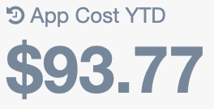
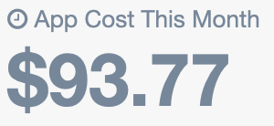
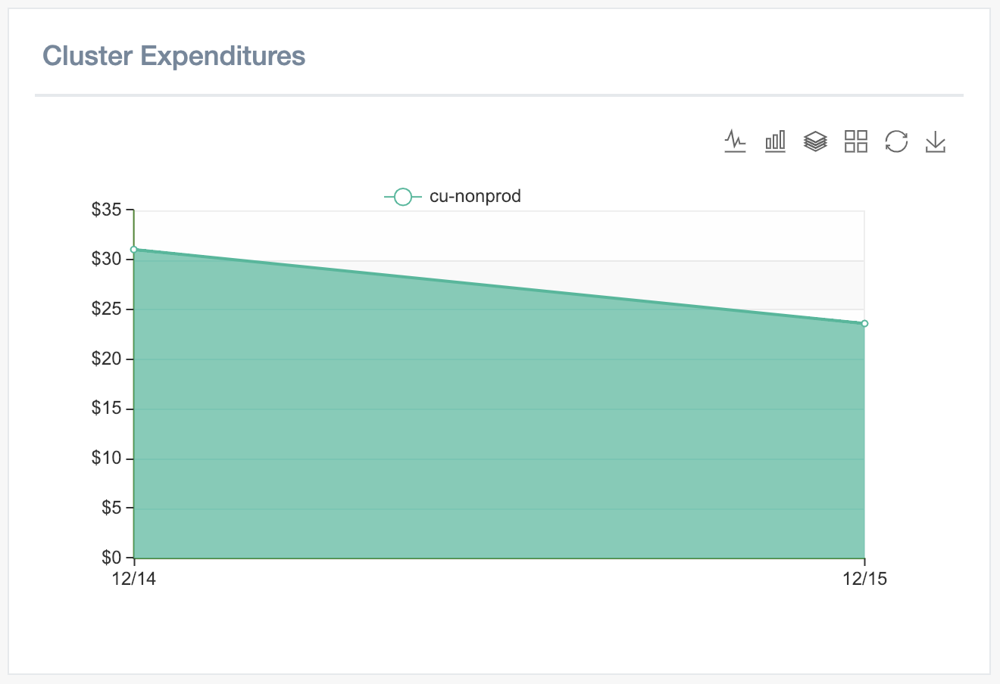
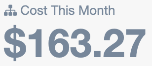
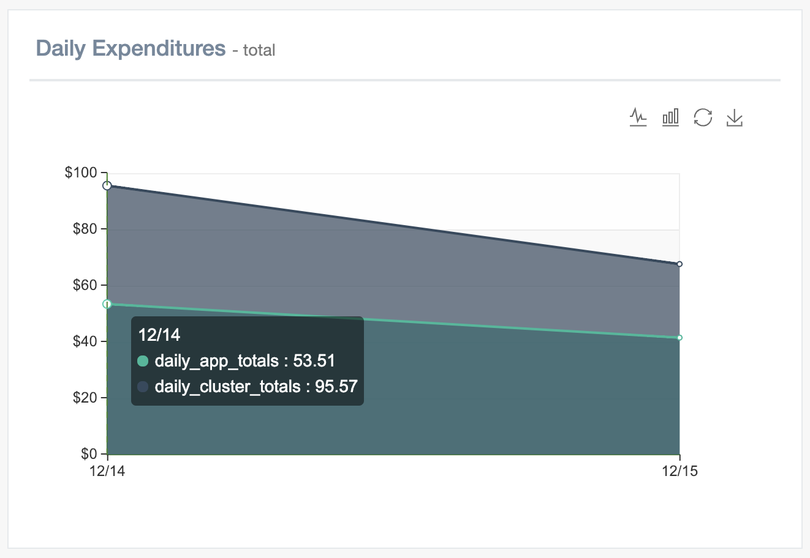
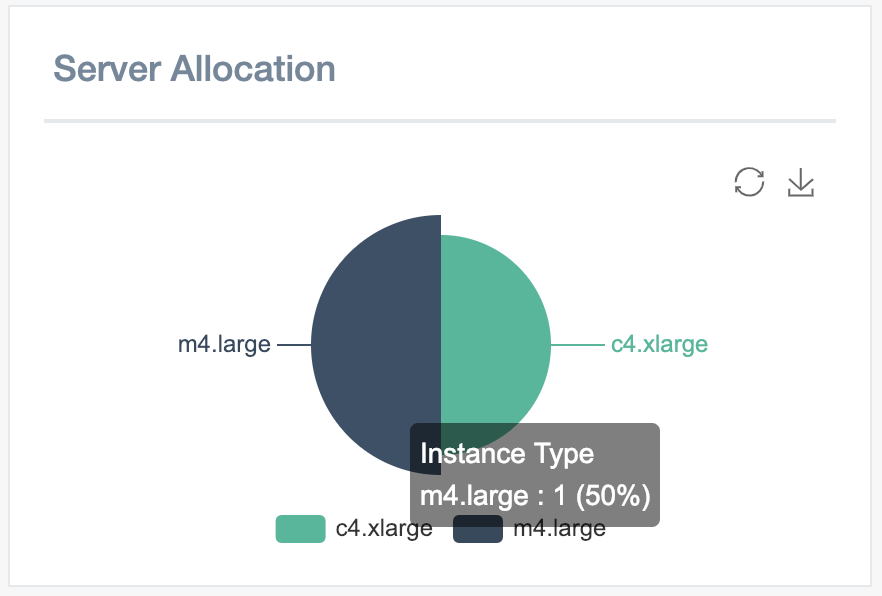
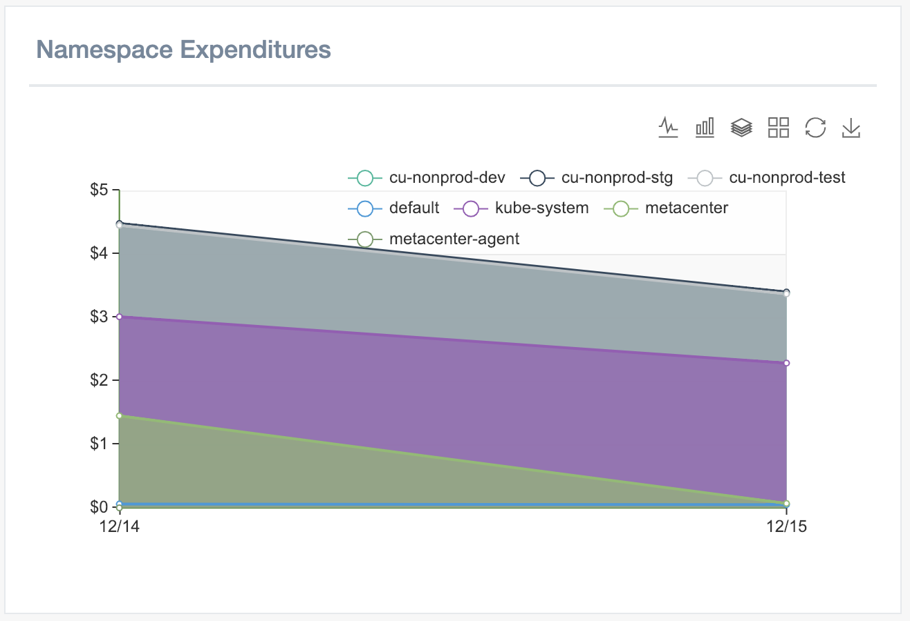
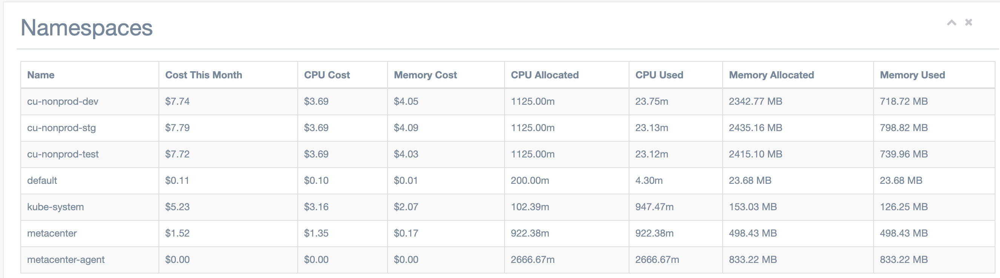
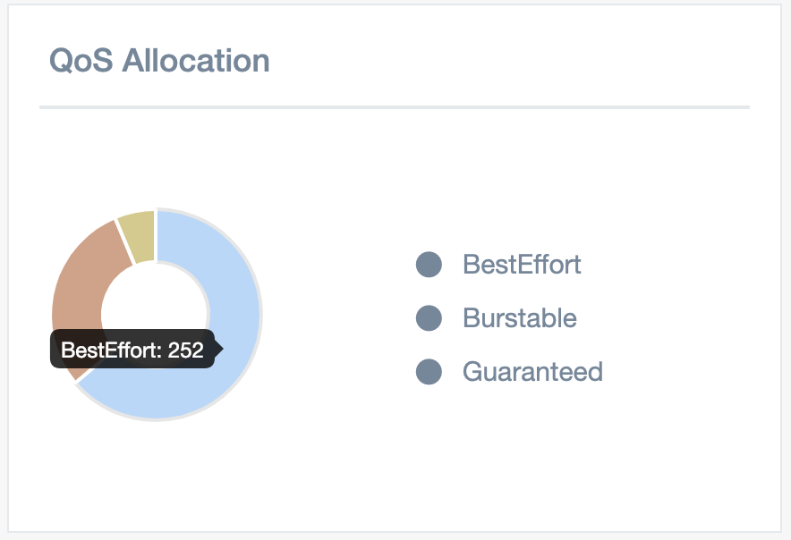

# Glossary

### Agent
Agent is a small container that runs inside a Kubernetes cluster.
It executes checks and manages the flow of data to Metacenter.

### App Cost YTD
A calculated measurement of applications costs for the current year.

### App Index 
Application Index provides an at-a-glance view of how efficiently, in terms of cost, applications are running.
The higher the percentage, the better.

This index represents the page being shown.
If viewing the home page, the index represents the efficiency of all clusters in a given month.

## App cost this Month
Calculated cost of applications for the given month based on the resources allocated.

### Cluster Expenditures
Daily server cost of a cluster.

### CPU Allocated
Measurement of CPU allocated in millicores. You may see this measurement in decimal form as it is measured in nano cores. This can differ from [CPU Used](/glossary?id=cpu-used) in burstable/guaranteed resource allocations.

### CPU Used
Measurement of actual CPU utilized by the application. This can be an area to gain efficiency if significantly different from [CPU Allocated](/glossary?id=cpu-allocated)

### Cost this Month
Kubernetes server cost for the current month.

### Daily Expenditures
Daily Expenditures demonstrate the application to infrastructure delta on a daily basis. The wider the gap, the more can be saved on a daily basis.

Use Case: Often used to demonstrate daily financial gains in efficiency.

### Indexes by Cluster
Shows the App/Op Index of each cluster monitored.

Use Case: Used to order clusters to target for efficiency gains.

### JSON Web Tokens
JSON Web Tokens (aka JWT) follow an industry standard of authentication using [RFC7519](https://tools.ietf.org/html/rfc7519).
For more information on JWT, [here is a helpful article](https://medium.com/vandium-software/5-easy-steps-to-understanding-json-web-tokens-jwt-1164c0adfcec)

### Memory Allocated
Measured in MegaBytes. Amount of memory allocated to an application. This can be an area to gain efficiency if significantly different from [Memory Used](/glossary?id=memory-used)

### Memory Used
Measured in MegaBytes. Amount of memory used by an application. This can be an area to gain efficiency if significantly different from [Memory Allocated](/glossary?id=memory-allocated)

### Metrics Server
A default application in Kubernetes 1.7+ which collects application metrics such as cpu, memory utilization for the purpose of facilitating cluster level requirements like autoscaling.

Link to [Metrics Server](https://kubernetes.io/docs/tasks/debug-application-cluster/core-metrics-pipeline/)

### Namespace Expenditures
Demonstrates breakdown of cluster costs by namespace.

### Namespace Table

Granular breakdown of cluster cost by Namespace.

### Op Index

Operational Index provides an at-a-glance view of how efficiently, in terms of cost, the server infrastructure is being utilized.
The higher the percentage, the better.

This index represents the page being shown.
If viewing a cluster, the index represents the efficiency of the cluster in a given month.

### Service Account
Service Accounts are identities stored in Metacenter by which agents can authenticate programmatically.
These accounts are limited to only posting data. They use industry standard JWT (JSON Web Tokens) for authentication.

### Server Allocation
Server allocation shows the distribution of server types in the Kubernetes cluster.

Use Case: Often used when determining a specific group of servers to resize to gain efficiency.

### QoS Allocation
Kubernetes uses Quality of Service for denoting both the priority of an application running but also the guaranteed of resources allocated. 

Use Case: Understand the distribution of QoS allocation which can have an impact on costs.

Guaranteed: Highest Priority, guaranteed resources. (without tuning can impact excess costs significantly)

Burstable: Medium Priority, guaranteed minimum resources. (resource tuning required)

BestEffort: Least Priority, no resource guarantees. (no excess cost)

