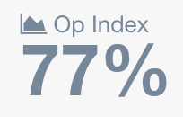
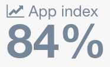

# Glossary

### Agent
Agent is a small container that runs inside a Kubernetes cluster.
It executes checks and manages the flow of data to Metacenter.

### Service Account
Service Accounts are identities stored in Metacenter by which agents can authenticate programmatically.
These accounts are limited to only posting data. They use industry standard JWT (JSON Web Tokens) for authentication.

### Op Index - 
Operational Index provides an at-a-glance view of how efficiently, in terms of cost, the server infrastructure is being utilized.
The higher the percentage, the better.

This index represents the page being shown.
If viewing a cluster, the index represents the efficiency of the cluster in a given month.

### App Index 

Application Index provides an at-a-glance view of how efficiently, in terms of cost, applications are running.
The higher the percentage, the better.

This index represents the page being shown.
If viewing the home page, the index represents the efficiency of all clusters in a given month.

### JSON Web Tokens
JSON Web Tokens (aka JWT) follow an industry standard of authentication using [RFC7519](https://tools.ietf.org/html/rfc7519).
For more information on JWT, [here is a helpful article](https://medium.com/vandium-software/5-easy-steps-to-understanding-json-web-tokens-jwt-1164c0adfcec)
