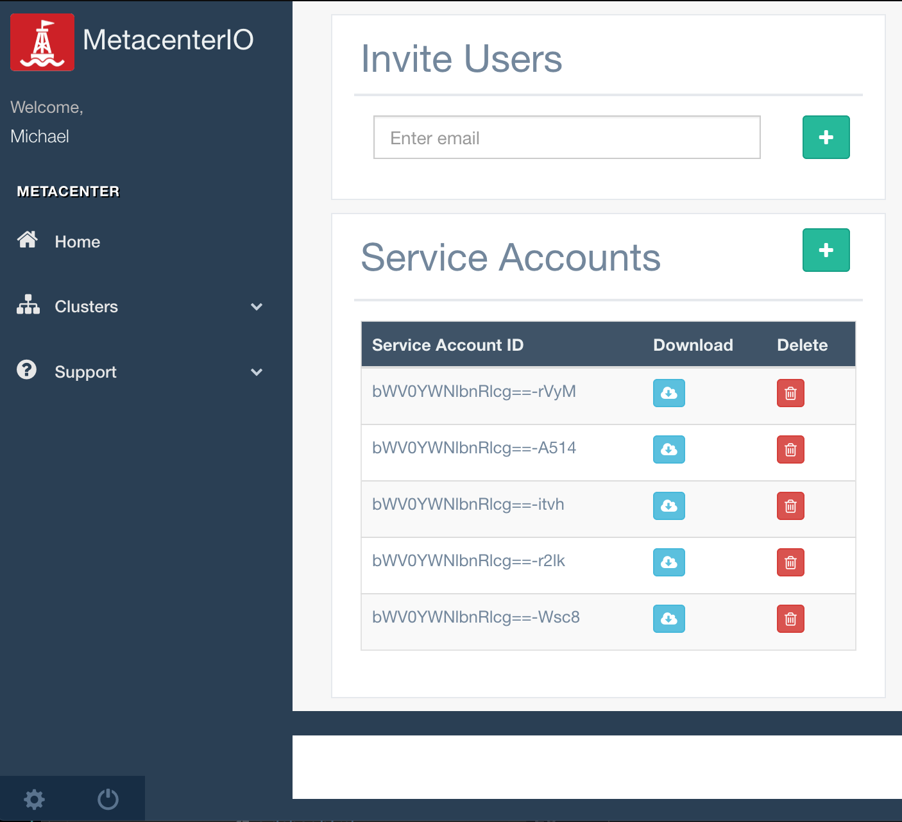
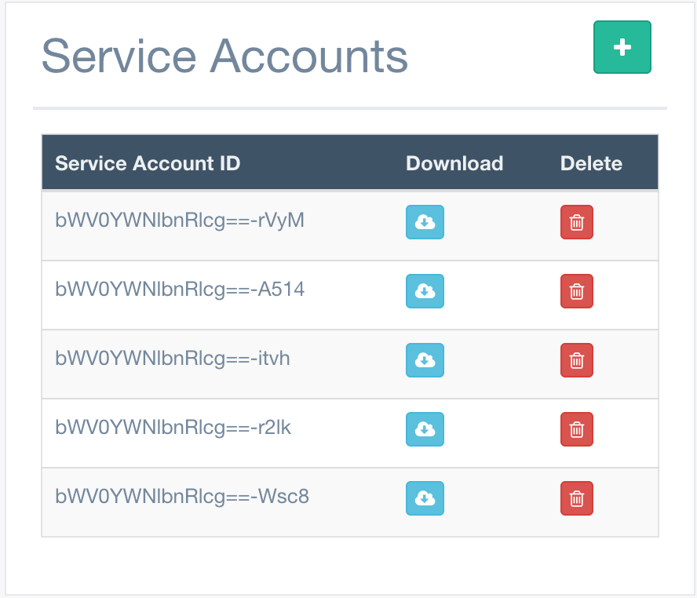

If you don't already have an account, head over to [Account Signup](https://console.metacenter.io/login#signup)


# Install

The MetacenterIO agent can be quickly deployed into any Kubernetes cluster running v1.8+.
Metacenter assumes RBAC (Role Based Access Control) is in user. If this is not the case, an alternate configuration can be provide upon request.


Metacenter relies on agents installed in your Kubernetes cluster to gather data for Metacenter to process.
One agent per Kubernetes cluster is necessary.
The agent runs as a Kubernetes Cronjob, executed every 15 minutes by default. 
Clusters running 100k+ pods/app instances may require upwards of 5 minutes processing time.

**resource requirements** are minimal. 120MB of memory.

## Download
Its easy to get started with Metacenter. 

First create a Service Account:

Look for the settings icon (<span class="fa fa-cog"></span>) in the lower left-hand corner of the screen. 



Click (<span class="fa fa-plus"></span>) to add a new Service Account.

Then download the configuration (<span class="fa fa-cloud-download"></span>)



For more information go to [Service Accounts](serviceaccount.md)

## Configure

Changes Required: `CLUSTER_NAME`, `REGION_CODE`

In case of `AWS`: Please check `INSTANCE_TENANCY` and `RESERVED_OR_ONDEMAND` as these values will effect the accuracy of Metacenter.

For instances where a Kubernetes cluster may execute pods for very short periods of time, its advised
to set `INSTANCE_TYPE`, `DEFAULT_CPU` and `DEFAULT_MEMORY`.
These settings will be used as a last resort in the event the agent is not able to assertain resource consumption of a pod.

The configuration you just downloaded will contain default settings that look something like this:
Overtime Metacenter has intends detect many of these settings automatically.

```
...
- name: CLUSTER_NAME          # K8s Cluster Name, used if not detected
  value: '<cluster_name>'
- name: REGION_CODE           # region code for Cloud Provider
  value: "<region_code>"
- name: INSTANCE_TENANCY      # For AWS, Shared or Dedicated
  value: "Shared"
- name: RESERVED_OR_ONDEMAND  # For AWS, Reserved or OnDemand
  value: "OnDemand"
- name: META_SERVICE          # Metacenter Service name
  value: "<service_account_id>"
- name: META_PASSWORD         # Metacenter Service password
  value: '<service_account_password>'
- name: ITERATE_TIME                 # how often to sample the k8s cluster in seconds
  value: "300"
- name: CLOUD_PROVIDER        # Set Cloud Provider (currently aws is supported)
  value: "aws"
- name: INSTANCE_TYPE         # Default instance type, only used if not set on nodes
  value: "c4.xlarge"
- name: DEFAULT_CPU           # Default CPU, used if metrics not available
  value: "1"
- name: DEFAULT_MEMORY        # Default memory, used if metrics not available
  value: "2Gi"
- name: RESPONSE_LIMIT        # Max Number of events to get from K8s API at one time
  value: "200"
...

```

## Deploy


```
kubectl apply -f mc_deploy.yaml

```