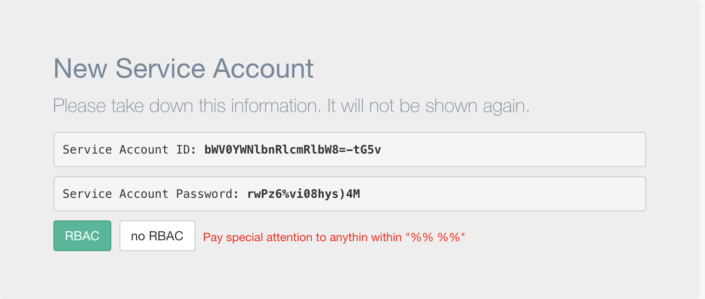

If you don't already have an account, head over to [Account Signup](https://metacenter.io/login#signup)


> Install

The MetacenterIO agent can be quickly deployed into any Kubernetes cluster running v1.8+.


Metacenter relies on an agent installed in your Kubernetes cluster.
The agent runs as a Kubernetes Cronjob, executed every 15 minutes by default. 


## Requirements
**[Metrics Server](https://github.com/kubernetes/kubernetes/tree/master/cluster/addons/metrics-server)** - Generally metrics server comes by default in any cluster running version 1.8+.

**Minimum Resource Requirements**
    - 250MB Memory
    - 500m CPU
    
?> By default, the agent is deployed as BestEffort, giving it the lowest priority in Kubernetes for resource consumption. If left with the default configuration, you may find the agent utilizing more resource than listed because it was available during execution.

## Download

First create a Service Account:

Look for the settings icon (<span class="fa fa-cog"></span>) in the lower left-hand corner of the screen. 


Once on the Settings Page, Click (<span class="fa fa-plus"></span>) next to Service Account.

A "New Service Account" window will appear with Account details.

Both `RBAC` and `no RBAC` configs are provided. 



**Pay special attention to anything within "%% %%"**

In particular:
```
- name: CLUSTER_NAME
  value: %%CLUSTER_NAME%%   # Ex. metacenter-demo
- name: REGION_CODE
  value: %%REGION%%         # Ex. us-east-1
```

Here is a link to more information about [Service Accounts](serviceaccount.md)


## Deploy


```
kubectl apply -f mc_deploy.yaml

```