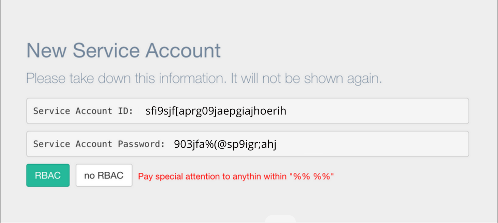

> Service Accounts

Service Accounts allow agents authentication to Metacenter. They are system level identities with
limited access.

Authentication is performed via JWT (JSON Web Token). A standard, secure authentication protocol. 

For security, service accounts can be created or deleted at any time and have no direct association to a given Kubernetes cluster.

## Creating a Service Account

Look for the settings icon (<span class="fa fa-cog"></span>) in the lower left-hand corner of the screen. 


Once on the Settings Page, Click (<span class="fa fa-plus"></span>) next to Service Account.

A "New Service Account" window will appear with Account details.

Both `RBAC` and `no RBAC` configs are provided.


## Updating an existing agent with a new Service Account

In the agent config, a Kubernetes secret exists.

```
apiVersion: v1
kind: Secret
metadata:
  name: mcsecret
  namespace: metacenter
type: Opaque
stringData:
  META_SERVICE: %%SERVICE_ACCOUNT_ID%%
  META_PASSWORD: %%SERVICE_ACCOUNT_PASSWORD%%
```

Once a new service account is created -

Put the `Service Account ID` in place of `%%SERVICE_ACCOUNT_ID%%`

and `Service Account Password` in place of `%%SERVICE_ACCOUNT_PASSWORD%%`



Then execute:

`kubectl apply -f mc_deploy.yaml`
